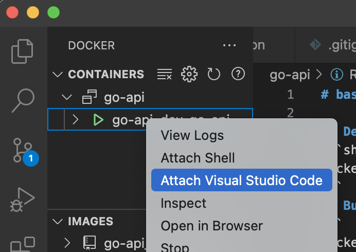

# basic crud api on golang gin framework

## Development

### 1. docker-compose up
```shell
docker-compose up
```
### 2. attatch vscode
<div style="text-align:center;"> 
    </img>
</div>

### 3. run main.go on debug

<div style="text-align:center;"> 
    </img>
</div>

## Build app image

```
docker build .
```

## reference
  - Hands-On Full-Stack Development with Go
  - https://github.com/gin-gonic/gin


